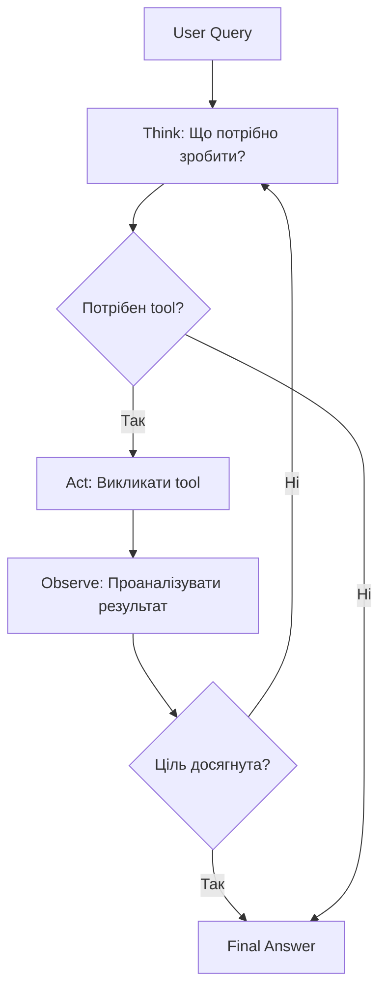
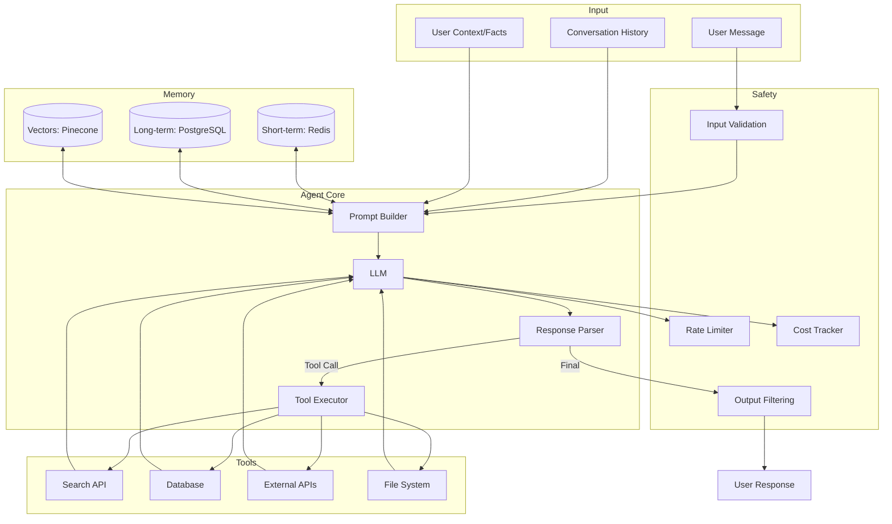

# 🚀 Основи LLM та AI-агентів для розробників — Part 2

---

# Модуль 3: Function Calling (Tool Use)

> 🎯 **Мета модуля:** Навчити LLM виконувати реальні дії — виклик API, запис у базу даних, відправка email.

## 3.1 Що таке Function Calling і навіщо це потрібно?

```
┌─────────────────────────────────────────────────────────────────┐
│                   Без Function Calling                          │
├─────────────────────────────────────────────────────────────────┤
│                                                                 │
│   User: "Яка погода в Києві?"                                  │
│                                                                 │
│   LLM: "Я не маю доступу до актуальних даних про погоду,      │
│         але зазвичай у січні в Києві близько -5°C..."          │
│                                                                 │
│   😢 Застаріла або вигадана інформація                         │
│                                                                 │
└─────────────────────────────────────────────────────────────────┘

┌─────────────────────────────────────────────────────────────────┐
│                   З Function Calling                            │
├─────────────────────────────────────────────────────────────────┤
│                                                                 │
│   User: "Яка погода в Києві?"                                  │
│                    │                                            │
│                    ▼                                            │
│   LLM: 🤔 "Потрібна реальна погода → викликаю getWeather"      │
│                    │                                            │
│                    ▼                                            │
│   Tool Call: getWeather({ city: "Kyiv" })                      │
│                    │                                            │
│                    ▼                                            │
│   API Response: { temp: 2, condition: "cloudy" }               │
│                    │                                            │
│                    ▼                                            │
│   LLM: "Зараз у Києві +2°C, хмарно."                           │
│                                                                 │
│   ✅ Актуальні реальні дані                                    │
│                                                                 │
└─────────────────────────────────────────────────────────────────┘
```

## 3.2 Повний потік виконання Function Call

```
┌──────────────────────────────────────────────────────────────────────────┐
│                        Function Calling Flow                              │
└──────────────────────────────────────────────────────────────────────────┘

     ┌─────────┐         ┌─────────┐         ┌─────────┐         ┌─────────┐
     │  User   │         │  Your   │         │   LLM   │         │ External│
     │         │         │  App    │         │   API   │         │   API   │
     └────┬────┘         └────┬────┘         └────┬────┘         └────┬────┘
          │                   │                   │                   │
          │ 1. "Погода в Києві?"                  │                   │
          │──────────────────▶│                   │                   │
          │                   │                   │                   │
          │                   │ 2. messages +     │                   │
          │                   │    tools definition                   │
          │                   │──────────────────▶│                   │
          │                   │                   │                   │
          │                   │ 3. tool_call:     │                   │
          │                   │    getWeather     │                   │
          │                   │◀──────────────────│                   │
          │                   │                   │                   │
          │                   │ 4. Execute function                   │
          │                   │────────────────────────────────────▶│
          │                   │                   │                   │
          │                   │ 5. Weather data   │                   │
          │                   │◀───────────────────────────────────│
          │                   │                   │                   │
          │                   │ 6. messages +     │                   │
          │                   │    tool_result    │                   │
          │                   │──────────────────▶│                   │
          │                   │                   │                   │
          │                   │ 7. Final text     │                   │
          │                   │◀──────────────────│                   │
          │                   │                   │                   │
          │ 8. "У Києві +2°C" │                   │                   │
          │◀──────────────────│                   │                   │
          │                   │                   │                   │
```

## 3.3 Реалізація з AI SDK

### Базовий приклад

```typescript
// function-calling-basic.ts
import { generateText } from 'ai';
import { openai } from '@ai-sdk/openai';
import { z } from 'zod';

// 1. Визначаємо tools з Zod схемами
const tools = {
  getWeather: {
    description: 'Отримує поточну погоду для вказаного міста',
    parameters: z.object({
      city: z.string().describe('Назва міста'),
      units: z.enum(['celsius', 'fahrenheit']).default('celsius')
    }),
    // 2. Функція що виконується при виклику
    execute: async ({ city, units }) => {
      // Тут був би реальний API call
      console.log(`🌤️ Викликаю Weather API для: ${city}`);
      
      // Симуляція відповіді
      return {
        city,
        temperature: units === 'celsius' ? 2 : 36,
        condition: 'cloudy',
        humidity: 75
      };
    }
  },
  
  searchWeb: {
    description: 'Шукає інформацію в інтернеті',
    parameters: z.object({
      query: z.string().describe('Пошуковий запит')
    }),
    execute: async ({ query }) => {
      console.log(`🔍 Шукаю: ${query}`);
      return {
        results: [
          { title: 'Результат 1', snippet: 'Опис результату...' },
          { title: 'Результат 2', snippet: 'Інший опис...' }
        ]
      };
    }
  }
};

async function chat(userMessage: string) {
  console.log(`\n👤 User: ${userMessage}\n`);
  
  const { text, toolCalls, toolResults } = await generateText({
    model: openai('gpt-4o'),
    tools,
    maxSteps: 5, // Дозволяємо до 5 послідовних викликів tools
    prompt: userMessage,
  });
  
  // Логуємо tool calls для debugging
  if (toolCalls.length > 0) {
    console.log('🔧 Tool calls:');
    toolCalls.forEach((call, i) => {
      console.log(`   ${i + 1}. ${call.toolName}(${JSON.stringify(call.args)})`);
    });
    console.log('');
  }
  
  console.log(`🤖 Assistant: ${text}`);
  return text;
}

// Тестуємо
await chat('Яка зараз погода в Києві та Львові?');
```

**📊 Вивід консолі:**
```
👤 User: Яка зараз погода в Києві та Львові?

🌤️ Викликаю Weather API для: Kyiv
🌤️ Викликаю Weather API для: Lviv

🔧 Tool calls:
   1. getWeather({"city":"Kyiv","units":"celsius"})
   2. getWeather({"city":"Lviv","units":"celsius"})

🤖 Assistant: Зараз погода:
- **Київ**: +2°C, хмарно, вологість 75%
- **Львів**: +2°C, хмарно, вологість 75%

Одягайтесь тепло! 🧥
```

## 3.4 Складніший приклад: Multi-step Agent

```typescript
// multi-tool-agent.ts
import { generateText } from 'ai';
import { openai } from '@ai-sdk/openai';
import { z } from 'zod';

// База даних користувачів (симуляція)
const usersDB = new Map([
  ['user_1', { name: 'Олена', email: 'olena@example.com', orders: ['order_101'] }],
  ['user_2', { name: 'Андрій', email: 'andrii@example.com', orders: ['order_102', 'order_103'] }],
]);

const ordersDB = new Map([
  ['order_101', { id: 'order_101', status: 'delivered', items: ['Laptop'], total: 35000 }],
  ['order_102', { id: 'order_102', status: 'shipped', items: ['Phone'], total: 15000 }],
  ['order_103', { id: 'order_103', status: 'processing', items: ['Headphones'], total: 3000 }],
]);

const tools = {
  getUserInfo: {
    description: 'Отримує інформацію про користувача за ID',
    parameters: z.object({
      userId: z.string()
    }),
    execute: async ({ userId }) => {
      const user = usersDB.get(userId);
      if (!user) return { error: 'Користувача не знайдено' };
      return user;
    }
  },
  
  getOrderStatus: {
    description: 'Перевіряє статус замовлення',
    parameters: z.object({
      orderId: z.string()
    }),
    execute: async ({ orderId }) => {
      const order = ordersDB.get(orderId);
      if (!order) return { error: 'Замовлення не знайдено' };
      return order;
    }
  },
  
  sendEmail: {
    description: 'Відправляє email користувачу',
    parameters: z.object({
      to: z.string().email(),
      subject: z.string(),
      body: z.string()
    }),
    execute: async ({ to, subject, body }) => {
      console.log(`📧 Відправляю email на ${to}`);
      console.log(`   Тема: ${subject}`);
      // В реальності тут був би код відправки
      return { success: true, messageId: 'msg_' + Date.now() };
    }
  }
};

async function supportAgent(userQuery: string, userId: string) {
  const systemPrompt = `Ти — агент підтримки інтернет-магазину.

Завжди починай з отримання інформації про користувача.
Якщо питання про замовлення — перевір статус кожного замовлення.
Після відповіді на питання — запропонуй відправити деталі на email.

ID поточного користувача: ${userId}`;

  const { text, steps } = await generateText({
    model: openai('gpt-4o'),
    system: systemPrompt,
    tools,
    maxSteps: 10,
    prompt: userQuery,
  });

  // Виводимо кроки для debugging
  console.log('\n📋 Кроки виконання:');
  steps.forEach((step, i) => {
    if (step.toolCalls) {
      step.toolCalls.forEach(call => {
        console.log(`   ${i + 1}. 🔧 ${call.toolName}(${JSON.stringify(call.args)})`);
      });
    }
    if (step.text) {
      console.log(`   ${i + 1}. 💬 Відповідь готова`);
    }
  });

  return text;
}

// Тестуємо
const response = await supportAgent(
  'Де моє останнє замовлення?', 
  'user_2'
);
console.log('\n🤖 Відповідь:', response);
```

**📊 Вивід консолі:**
```
📋 Кроки виконання:
   1. 🔧 getUserInfo({"userId":"user_2"})
   2. 🔧 getOrderStatus({"orderId":"order_103"})
   3. 🔧 getOrderStatus({"orderId":"order_102"})
   4. 💬 Відповідь готова

🤖 Відповідь: Привіт, Андрію! 

Ваше останнє замовлення (order_103) зі статусом "В обробці":
- Товар: Headphones
- Сума: 3000 грн

Також у вас є замовлення order_102 (телефон), яке вже відправлено!

Хочете, щоб я відправив деталі на вашу пошту andrii@example.com?
```

## 3.5 Обробка помилок у Tools

```typescript
// tool-error-handling.ts
const tools = {
  riskyOperation: {
    description: 'Операція що може впасти',
    parameters: z.object({ data: z.string() }),
    execute: async ({ data }) => {
      try {
        // Симуляція помилки
        if (data === 'fail') {
          throw new Error('Database connection failed');
        }
        return { success: true, result: data.toUpperCase() };
      } catch (error) {
        // ✅ Повертаємо помилку як дані, не кидаємо exception
        return { 
          success: false, 
          error: error instanceof Error ? error.message : 'Unknown error',
          suggestion: 'Спробуйте пізніше або зверніться до підтримки'
        };
      }
    }
  }
};

// Модель отримає помилку як результат і зможе про неї повідомити користувачу
```

### ❌ Типова помилка: Tool не викликається

**Симптом:**
```
User: "Покажи погоду"
Assistant: "Щоб показати погоду, мені потрібно знати місто. Яке місто вас цікавить?"
// Модель питає замість того щоб викликати tool з default значенням
```

**Рішення:**
```typescript
// ❌ НЕПРАВИЛЬНО
const tools = {
  getWeather: {
    description: 'Gets weather',
    parameters: z.object({
      city: z.string() // Обов'язкове поле без підказки
    })
  }
};

// ✅ ПРАВИЛЬНО
const tools = {
  getWeather: {
    description: `Отримує погоду. 
    
ЗАВЖДИ викликай цей tool для погодних запитів.
Якщо місто не вказано — використовуй "Київ" за замовчуванням.`,
    parameters: z.object({
      city: z.string()
        .default('Київ')
        .describe('Місто. За замовчуванням — Київ')
    })
  }
};
```

## 3.6 Паралельні vs Послідовні виклики

```typescript
// parallel-tools.ts
import { generateText } from 'ai';
import { openai } from '@ai-sdk/openai';
import { z } from 'zod';

// Модель сама вирішує що можна виконати паралельно
const tools = {
  getWeather: {
    description: 'Отримує погоду (швидко, можна паралельно)',
    parameters: z.object({ city: z.string() }),
    execute: async ({ city }) => {
      console.log(`⏱️ ${Date.now()}: Starting weather for ${city}`);
      await new Promise(r => setTimeout(r, 1000)); // Симуляція API
      console.log(`✅ ${Date.now()}: Done weather for ${city}`);
      return { city, temp: Math.floor(Math.random() * 30) };
    }
  },
  
  bookHotel: {
    description: 'Бронює готель (потребує результат погоди)',
    parameters: z.object({ 
      city: z.string(),
      date: z.string() 
    }),
    execute: async ({ city, date }) => {
      console.log(`🏨 Booking hotel in ${city} for ${date}`);
      return { confirmation: 'BOOK123', city, date };
    }
  }
};

// Запит: "Яка погода в Києві, Львові та Одесі?"
// Модель викличе 3 getWeather ПАРАЛЕЛЬНО

// Запит: "Знайди де тепліше — Київ чи Львів — і забронюй там готель"
// Модель викличе getWeather паралельно, потім bookHotel послідовно
```

## 🤔 Перевір себе

1. Чому execute функція повертає error як дані, а не кидає exception?
2. Коли модель викликає tools паралельно, а коли послідовно?
3. Як змусити модель ЗАВЖДИ викликати tool замість текстової відповіді?

<details>
<summary>📝 Відповіді</summary>

1. Якщо кинути exception, весь запит впаде. Якщо повернути error як дані — модель зможе повідомити про проблему користувачу і запропонувати альтернативу.

2. Паралельно — коли виклики незалежні (погода в різних містах). Послідовно — коли один виклик потребує результату іншого.

3. Використати `toolChoice: 'required'` або конкретний tool: `toolChoice: { type: 'tool', toolName: 'getWeather' }`
</details>

---

# Модуль 4: AI Агенти

> 🎯 **Мета модуля:** Побудувати автономного агента, який може планувати, виконувати дії та досягати цілей.

## 4.1 Що відрізняє Агента від простого Chatbot?

```
┌─────────────────────────────────────────────────────────────────┐
│                        CHATBOT                                  │
├─────────────────────────────────────────────────────────────────┤
│                                                                 │
│   User ──────▶ LLM ──────▶ Response                            │
│                                                                 │
│   • Один запит → одна відповідь                                │
│   • Не може планувати                                          │
│   • Не пам'ятає контекст (без додаткової логіки)              │
│                                                                 │
└─────────────────────────────────────────────────────────────────┘

┌─────────────────────────────────────────────────────────────────┐
│                         AGENT                                   │
├─────────────────────────────────────────────────────────────────┤
│                                                                 │
│   User ──────▶ ┌─────────────────────────────────┐              │
│                │           AGENT LOOP            │              │
│                │  ┌───────────────────────────┐  │              │
│                │  │  1. Think (Reasoning)     │  │              │
│                │  │  2. Plan (Decomposition)  │  │              │
│                │  │  3. Act (Tool execution)  │  │              │
│                │  │  4. Observe (Results)     │  │              │
│                │  │  5. Repeat until done     │  │              │
│                │  └───────────────────────────┘  │              │
│                └─────────────────────────────────┘              │
│                              │                                  │
│                              ▼                                  │
│                          Response                               │
│                                                                 │
│   • Багатокрокове виконання                                    │
│   • Автономне планування                                       │
│   • Пам'ять та контекст                                        │
│                                                                 │
└─────────────────────────────────────────────────────────────────┘
```

## 4.2 ReAct Pattern (Reason + Act)



### Реалізація ReAct агента з логуванням

```typescript
// react-agent.ts
import { generateText } from 'ai';
import { openai } from '@ai-sdk/openai';
import { z } from 'zod';

// Типи для логування
interface AgentStep {
  stepNumber: number;
  thought?: string;
  action?: { tool: string; args: unknown };
  observation?: unknown;
  finalAnswer?: string;
}

// Tools
const tools = {
  search: {
    description: 'Шукає інформацію в базі знань',
    parameters: z.object({ query: z.string() }),
    execute: async ({ query }) => {
      // Симуляція пошуку
      return { 
        results: [`Інформація про "${query}"...`],
        source: 'knowledge_base'
      };
    }
  },
  
  calculate: {
    description: 'Виконує математичні обчислення',
    parameters: z.object({ expression: z.string() }),
    execute: async ({ expression }) => {
      try {
        // УВАГА: eval небезпечний в production!
        const result = Function(`"use strict"; return (${expression})`)();
        return { result, expression };
      } catch {
        return { error: 'Невалідний вираз' };
      }
    }
  },
  
  getCurrentDate: {
    description: 'Повертає поточну дату та час',
    parameters: z.object({}),
    execute: async () => {
      return { 
        date: new Date().toISOString(),
        timezone: 'UTC'
      };
    }
  }
};

async function runReActAgent(query: string, maxSteps: number = 10) {
  console.log('═'.repeat(60));
  console.log(`🎯 Query: ${query}`);
  console.log('═'.repeat(60));
  
  const steps: AgentStep[] = [];
  
  const { text, steps: aiSteps } = await generateText({
    model: openai('gpt-4o'),
    maxSteps,
    tools,
    system: `Ти — AI агент що використовує ReAct pattern.

Для кожного кроку:
1. THINK: Поясни своє міркування
2. ACT: Виконай потрібну дію (tool)
3. OBSERVE: Проаналізуй результат

Продовжуй поки не отримаєш фінальну відповідь.`,
    prompt: query,
  });
  
  // Красивий вивід кроків
  aiSteps.forEach((step, index) => {
    console.log(`\n[Step ${index + 1}]`);
    
    if (step.toolCalls?.length > 0) {
      step.toolCalls.forEach(call => {
        console.log(`  🤔 Thought: Потрібно викликати ${call.toolName}`);
        console.log(`  🔧 Action: ${call.toolName}(${JSON.stringify(call.args)})`);
      });
    }
    
    if (step.toolResults?.length > 0) {
      step.toolResults.forEach(result => {
        console.log(`  📊 Observation: ${JSON.stringify(result.result).slice(0, 100)}...`);
      });
    }
  });
  
  console.log(`\n[Final Answer]`);
  console.log(`  ✅ ${text}`);
  console.log('═'.repeat(60));
  
  return text;
}

// Тест
await runReActAgent('Скільки днів пройшло з 1 січня 2024 року до сьогодні?');
```

**📊 Вивід консолі:**
```
════════════════════════════════════════════════════════════
🎯 Query: Скільки днів пройшло з 1 січня 2024 року до сьогодні?
════════════════════════════════════════════════════════════

[Step 1]
  🤔 Thought: Потрібно викликати getCurrentDate
  🔧 Action: getCurrentDate({})
  📊 Observation: {"date":"2026-01-24T12:30:00.000Z","timezone":"UTC"}...

[Step 2]
  🤔 Thought: Потрібно викликати calculate
  🔧 Action: calculate({"expression":"Math.floor((new Date('2026-01-24') - new Date('2024-01-01')) / (1000 * 60 * 60 * 24))"})
  📊 Observation: {"result":754,"expression":"..."}...

[Final Answer]
  ✅ З 1 січня 2024 року до сьогодні (24 січня 2026) пройшло 754 дні.
════════════════════════════════════════════════════════════
```

## 4.3 Memory: Як агент пам'ятає контекст

### Типи пам'яті агента

```
┌─────────────────────────────────────────────────────────────────┐
│                    AGENT MEMORY TYPES                           │
├─────────────────────────────────────────────────────────────────┤
│                                                                 │
│  ┌─────────────────────┐                                       │
│  │  SHORT-TERM MEMORY  │  ← Conversation history               │
│  │  (Working Memory)   │  ← Current task context               │
│  │                     │  ← Recent tool results                │
│  └─────────────────────┘                                       │
│           │                                                     │
│           ▼                                                     │
│  ┌─────────────────────┐                                       │
│  │   LONG-TERM MEMORY  │  ← User preferences                   │
│  │   (Persistent)      │  ← Past conversations summary         │
│  │                     │  ← Learned facts                      │
│  └─────────────────────┘                                       │
│           │                                                     │
│           ▼                                                     │
│  ┌─────────────────────┐                                       │
│  │  EPISODIC MEMORY    │  ← Specific past interactions         │
│  │  (Events)           │  ← "Минулого тижня ви питали про..."  │
│  └─────────────────────┘                                       │
│                                                                 │
└─────────────────────────────────────────────────────────────────┘
```

### SQL схема для зберігання розмов

```sql
-- conversations.sql

-- Таблиця сесій
CREATE TABLE conversations (
  id TEXT PRIMARY KEY,
  user_id TEXT NOT NULL,
  title TEXT,
  created_at TIMESTAMP DEFAULT CURRENT_TIMESTAMP,
  updated_at TIMESTAMP DEFAULT CURRENT_TIMESTAMP,
  metadata JSON DEFAULT '{}'
);

-- Таблиця повідомлень
CREATE TABLE messages (
  id TEXT PRIMARY KEY,
  conversation_id TEXT NOT NULL REFERENCES conversations(id),
  role TEXT NOT NULL CHECK (role IN ('user', 'assistant', 'system', 'tool')),
  content TEXT NOT NULL,
  tool_calls JSON,           -- Для assistant: виклики tools
  tool_call_id TEXT,         -- Для tool: ID виклику на який відповідаємо
  tokens_used INTEGER,
  created_at TIMESTAMP DEFAULT CURRENT_TIMESTAMP,
  
  FOREIGN KEY (conversation_id) REFERENCES conversations(id) ON DELETE CASCADE
);

-- Таблиця фактів про користувача (long-term memory)
CREATE TABLE user_facts (
  id TEXT PRIMARY KEY,
  user_id TEXT NOT NULL,
  fact_type TEXT NOT NULL,   -- 'preference', 'info', 'behavior'
  fact_key TEXT NOT NULL,    -- 'name', 'language', 'timezone'
  fact_value TEXT NOT NULL,
  confidence REAL DEFAULT 1.0,
  source_message_id TEXT REFERENCES messages(id),
  created_at TIMESTAMP DEFAULT CURRENT_TIMESTAMP,
  
  UNIQUE(user_id, fact_key)
);

-- Індекси для швидкого пошуку
CREATE INDEX idx_messages_conversation ON messages(conversation_id);
CREATE INDEX idx_user_facts_user ON user_facts(user_id);
CREATE INDEX idx_conversations_user ON conversations(user_id);
```

### TypeScript реалізація Memory Manager

```typescript
// memory-manager.ts
import Database from 'better-sqlite3';
import { v4 as uuid } from 'uuid';

interface Message {
  role: 'user' | 'assistant' | 'system' | 'tool';
  content: string;
  toolCalls?: any[];
  toolCallId?: string;
}

class MemoryManager {
  private db: Database.Database;
  
  constructor(dbPath: string = ':memory:') {
    this.db = new Database(dbPath);
    this.initSchema();
  }
  
  private initSchema() {
    // Створюємо таблиці (SQL з попереднього прикладу)
    this.db.exec(`
      CREATE TABLE IF NOT EXISTS conversations (
        id TEXT PRIMARY KEY,
        user_id TEXT NOT NULL,
        title TEXT,
        created_at TEXT DEFAULT (datetime('now')),
        updated_at TEXT DEFAULT (datetime('now'))
      );
      
      CREATE TABLE IF NOT EXISTS messages (
        id TEXT PRIMARY KEY,
        conversation_id TEXT NOT NULL,
        role TEXT NOT NULL,
        content TEXT NOT NULL,
        tool_calls TEXT,
        tool_call_id TEXT,
        created_at TEXT DEFAULT (datetime('now'))
      );
      
      CREATE TABLE IF NOT EXISTS user_facts (
        id TEXT PRIMARY KEY,
        user_id TEXT NOT NULL,
        fact_key TEXT NOT NULL,
        fact_value TEXT NOT NULL,
        UNIQUE(user_id, fact_key)
      );
    `);
  }
  
  // Створити нову розмову
  createConversation(userId: string, title?: string): string {
    const id = uuid();
    this.db.prepare(
      'INSERT INTO conversations (id, user_id, title) VALUES (?, ?, ?)'
    ).run(id, userId, title || 'Нова розмова');
    return id;
  }
  
  // Додати повідомлення
  addMessage(conversationId: string, message: Message): string {
    const id = uuid();
    this.db.prepare(`
      INSERT INTO messages (id, conversation_id, role, content, tool_calls, tool_call_id)
      VALUES (?, ?, ?, ?, ?, ?)
    `).run(
      id,
      conversationId,
      message.role,
      message.content,
      message.toolCalls ? JSON.stringify(message.toolCalls) : null,
      message.toolCallId || null
    );
    return id;
  }
  
  // Отримати історію розмови
  getConversationHistory(conversationId: string, limit: number = 50): Message[] {
    const rows = this.db.prepare(`
      SELECT role, content, tool_calls, tool_call_id
      FROM messages
      WHERE conversation_id = ?
      ORDER BY created_at ASC
      LIMIT ?
    `).all(conversationId, limit) as any[];
    
    return rows.map(row => ({
      role: row.role,
      content: row.content,
      toolCalls: row.tool_calls ? JSON.parse(row.tool_calls) : undefined,
      toolCallId: row.tool_call_id || undefined
    }));
  }
  
  // Зберегти факт про користувача
  saveUserFact(userId: string, key: string, value: string): void {
    this.db.prepare(`
      INSERT OR REPLACE INTO user_facts (id, user_id, fact_key, fact_value)
      VALUES (?, ?, ?, ?)
    `).run(uuid(), userId, key, value);
  }
  
  // Отримати всі факти про користувача
  getUserFacts(userId: string): Record<string, string> {
    const rows = this.db.prepare(
      'SELECT fact_key, fact_value FROM user_facts WHERE user_id = ?'
    ).all(userId) as any[];
    
    return Object.fromEntries(rows.map(r => [r.fact_key, r.fact_value]));
  }
  
  // Побудувати контекст для LLM
  buildContext(userId: string, conversationId: string): string {
    const facts = this.getUserFacts(userId);
    const history = this.getConversationHistory(conversationId, 20);
    
    let context = '';
    
    if (Object.keys(facts).length > 0) {
      context += 'Відомі факти про користувача:\n';
      for (const [key, value] of Object.entries(facts)) {
        context += `- ${key}: ${value}\n`;
      }
      context += '\n';
    }
    
    return context;
  }
}

// Використання
const memory = new MemoryManager('./chat.db');

const userId = 'user_123';
const convId = memory.createConversation(userId, 'Допомога з кодом');

// Зберігаємо факти
memory.saveUserFact(userId, 'name', 'Олександр');
memory.saveUserFact(userId, 'language', 'TypeScript');
memory.saveUserFact(userId, 'experience', 'senior');

// Додаємо повідомлення
memory.addMessage(convId, { role: 'user', content: 'Привіт!' });
memory.addMessage(convId, { role: 'assistant', content: 'Привіт, Олександре!' });

// Отримуємо контекст для наступного запиту
const context = memory.buildContext(userId, convId);
console.log(context);
// Відомі факти про користувача:
// - name: Олександр
// - language: TypeScript
// - experience: senior
```

## 4.4 Критерії зупинки Agent Loop

```typescript
// agent-stop-conditions.ts

interface AgentConfig {
  maxIterations: number;      // Максимум кроків
  maxTokens: number;          // Бюджет токенів
  timeoutMs: number;          // Таймаут
  stopPhrases: string[];      // Фрази що означають завершення
}

const defaultConfig: AgentConfig = {
  maxIterations: 10,
  maxTokens: 50000,
  timeoutMs: 60000,
  stopPhrases: [
    'TASK_COMPLETE',
    'Завдання виконано',
    'Не можу продовжити'
  ]
};

async function runAgentWithStopConditions(
  query: string,
  config: AgentConfig = defaultConfig
): Promise<{ result: string; reason: string; steps: number }> {
  const startTime = Date.now();
  let totalTokens = 0;
  let steps = 0;
  
  const { text, steps: aiSteps, usage } = await generateText({
    model: openai('gpt-4o'),
    maxSteps: config.maxIterations,
    tools,
    system: `Ти — агент. Коли завдання виконано, напиши "TASK_COMPLETE" в кінці відповіді.`,
    prompt: query,
    
    // Перевірка на кожному кроці
    onStepFinish: async (step) => {
      steps++;
      totalTokens += step.usage?.totalTokens || 0;
      const elapsed = Date.now() - startTime;
      
      console.log(`Step ${steps}: ${totalTokens} tokens, ${elapsed}ms`);
      
      // Перевіряємо умови зупинки
      if (totalTokens > config.maxTokens) {
        throw new Error('TOKEN_LIMIT');
      }
      if (elapsed > config.timeoutMs) {
        throw new Error('TIMEOUT');
      }
    }
  });
  
  // Визначаємо причину завершення
  let reason = 'max_steps';
  if (config.stopPhrases.some(phrase => text.includes(phrase))) {
    reason = 'completed';
  }
  
  return { result: text, reason, steps };
}
```

## 4.5 Архітектура Production-Ready агента



## 🤔 Перевір себе

1. Яка різниця між ReAct і звичайним function calling?
2. Навіщо потрібна long-term memory якщо є conversation history?
3. Чому важливо мати критерії зупинки для агента?

<details>
<summary>📝 Відповіді</summary>

1. ReAct додає явний крок "думання" (reasoning) перед кожною дією. Це покращує якість рішень і дозволяє агенту планувати кілька кроків наперед.

2. Conversation history очищається між сесіями. Long-term memory зберігає важливі факти про користувача (ім'я, preferences) постійно.

3. Без критеріїв зупинки агент може: зациклитися (infinite loop), витратити весь бюджет токенів, працювати занадто довго. Критерії захищають від цих проблем.
</details>

---

# 🌍 Real-World Use Cases

> 🎯 **Мета:** Три повних production-ready приклади з робочим кодом, архітектурою та оцінкою вартості.

## Use Case 1: Customer Support Bot

### 📋 Бізнес-задача
Автоматизувати першу лінію підтримки: класифікація тікетів, автоматичні відповіді на типові питання, ескалація складних кейсів.

### 🏗️ Архітектура

```
┌──────────────────────────────────────────────────────────────────┐
│                    CUSTOMER SUPPORT BOT                          │
└──────────────────────────────────────────────────────────────────┘

  Customer          ┌─────────────────────────────────────┐
     │              │           SUPPORT BOT               │
     │              │                                     │
     │   Message    │  ┌───────────┐    ┌─────────────┐  │
     │─────────────▶│  │ Classifier│───▶│  Router     │  │
     │              │  │ (Intent)  │    │             │  │
     │              │  └───────────┘    └──────┬──────┘  │
     │              │                          │         │
     │              │         ┌────────────────┼─────────┤
     │              │         ▼                ▼         │
     │              │  ┌───────────┐    ┌───────────┐   │
     │              │  │ Knowledge │    │ Escalation│   │
     │              │  │ Base RAG  │    │ to Human  │   │
     │              │  └─────┬─────┘    └───────────┘   │
     │              │        │                          │
     │              │        ▼                          │
     │              │  ┌───────────┐                    │
     │              │  │ Response  │                    │
     │   Response   │  │ Generator │                    │
     │◀─────────────│  └───────────┘                    │
     │              │                                     │
     │              └─────────────────────────────────────┘
```

### 💻 Повний робочий код

```typescript
// support-bot.ts
import { generateObject, generateText } from 'ai';
import { openai } from '@ai-sdk/openai';
import { z } from 'zod';

// === СХЕМИ ===

const TicketClassification = z.object({
  category: z.enum([
    'billing',      // Питання по оплаті
    'technical',    // Технічні проблеми
    'account',      // Питання акаунту
    'product',      // Питання по продукту
    'complaint',    // Скарги
    'other'         // Інше
  ]),
  urgency: z.enum(['low', 'medium', 'high', 'critical']),
  sentiment: z.enum(['positive', 'neutral', 'negative', 'angry']),
  requiresHuman: z.boolean(),
  reason: z.string().describe('Чому вимагає/не вимагає людину'),
  suggestedTags: z.array(z.string()).max(5)
});

const KnowledgeArticle = z.object({
  id: z.string(),
  title: z.string(),
  content: z.string(),
  relevance: z.number().min(0).max(1)
});

// === БАЗА ЗНАНЬ (спрощена) ===

const knowledgeBase = [
  {
    id: 'kb_001',
    category: 'billing',
    title: 'Як змінити платіжну карту',
    content: `Щоб змінити платіжну карту:
1. Зайдіть в Налаштування → Оплата
2. Натисніть "Змінити карту"
3. Введіть нові дані
4. Підтвердіть зміни

Зміни набудуть чинності для наступного списання.`
  },
  {
    id: 'kb_002',
    category: 'billing',
    title: 'Повернення коштів',
    content: `Повернення можливе протягом 14 днів після покупки.

Для запиту повернення:
1. Напишіть на billing@company.com
2. Вкажіть номер замовлення
3. Опишіть причину

Кошти повернуться протягом 5-7 робочих днів.`
  },
  {
    id: 'kb_003',
    category: 'technical',
    title: 'Додаток не запускається',
    content: `Якщо додаток не запускається:
1. Перезавантажте пристрій
2. Перевірте оновлення додатку
3. Очистіть кеш додатку
4. Перевстановіть додаток

Якщо проблема залишається — зверніться до підтримки з логами.`
  }
];

// === ФУНКЦІЇ ===

async function classifyTicket(message: string): Promise<z.infer<typeof TicketClassification>> {
  const { object } = await generateObject({
    model: openai('gpt-4o-mini'), // Дешевша модель для класифікації
    schema: TicketClassification,
    system: `Ти — система класифікації тікетів підтримки.

Правила для requiresHuman = true:
- Скарги з негативним sentiment
- Питання про повернення коштів > $100
- Згадування юристів, позовів, медіа
- Технічні проблеми з втратою даних
- Все що потребує прийняття рішення`,
    prompt: `Класифікуй цей тікет:\n\n"${message}"`
  });
  
  return object;
}

async function findRelevantArticles(
  message: string, 
  category: string
): Promise<typeof knowledgeBase> {
  // В production тут був би векторний пошук
  const relevant = knowledgeBase.filter(
    article => article.category === category
  );
  return relevant.slice(0, 3);
}

async function generateResponse(
  message: string,
  articles: typeof knowledgeBase,
  classification: z.infer<typeof TicketClassification>
): Promise<string> {
  const articlesContext = articles.length > 0
    ? articles.map(a => `### ${a.title}\n${a.content}`).join('\n\n')
    : 'Релевантних статей не знайдено.';
  
  const { text } = await generateText({
    model: openai('gpt-4o-mini'),
    system: `Ти — дружній агент підтримки компанії TechCorp.

Стиль відповіді:
- Ввічливий але не занадто формальний
- Конкретний і корисний
- Якщо не знаєш — чесно визнай

Категорія тікету: ${classification.category}
Терміновість: ${classification.urgency}`,
    prompt: `Повідомлення клієнта: "${message}"

Релевантні статті з бази знань:
${articlesContext}

Дай корисну відповідь клієнту.`
  });
  
  return text;
}

// === ГОЛОВНИЙ FLOW ===

interface SupportResponse {
  classification: z.infer<typeof TicketClassification>;
  response: string;
  escalated: boolean;
  articlesUsed: string[];
  processingTimeMs: number;
}

async function handleSupportTicket(message: string): Promise<SupportResponse> {
  const startTime = Date.now();
  
  console.log('📨 Новий тікет:', message.slice(0, 50) + '...\n');
  
  // Крок 1: Класифікація
  console.log('🏷️ Класифікую...');
  const classification = await classifyTicket(message);
  console.log('   Категорія:', classification.category);
  console.log('   Терміновість:', classification.urgency);
  console.log('   Sentiment:', classification.sentiment);
  console.log('   Потрібна людина:', classification.requiresHuman);
  
  // Крок 2: Перевірка на ескалацію
  if (classification.requiresHuman) {
    console.log('\n🚨 ЕСКАЛАЦІЯ:', classification.reason);
    return {
      classification,
      response: `Дякую за звернення! Я передаю ваш запит спеціалісту, який зв'яжеться з вами протягом 2 годин. Номер вашого тікету: TKT-${Date.now()}`,
      escalated: true,
      articlesUsed: [],
      processingTimeMs: Date.now() - startTime
    };
  }
  
  // Крок 3: Пошук релевантних статей
  console.log('\n📚 Шукаю в базі знань...');
  const articles = await findRelevantArticles(message, classification.category);
  console.log(`   Знайдено ${articles.length} статей`);
  
  // Крок 4: Генерація відповіді
  console.log('\n✍️ Генерую відповідь...');
  const response = await generateResponse(message, articles, classification);
  
  console.log('\n✅ Готово!\n');
  
  return {
    classification,
    response,
    escalated: false,
    articlesUsed: articles.map(a => a.id),
    processingTimeMs: Date.now() - startTime
  };
}

// === ТЕСТУВАННЯ ===

async function runTests() {
  const testCases = [
    'Як мені змінити карту для оплати підписки?',
    'ВАШ ДОДАТОК НЕ ПРАЦЮЄ ВЖЕ 3 ДНІ!!! Я ВТРАТИВ ВСІ СВОЇ ДАНІ!!! ПОВЕРНІТЬ ГРОШІ АБО Я ПОДАМ В СУД!',
    'Додаток вилітає при запуску на iPhone 14'
  ];
  
  for (const testCase of testCases) {
    console.log('═'.repeat(60));
    const result = await handleSupportTicket(testCase);
    console.log('📝 Відповідь:');
    console.log(result.response);
    console.log(`\n⏱️ Час: ${result.processingTimeMs}ms`);
    console.log('═'.repeat(60) + '\n');
  }
}

runTests();
```

**📊 Приклад виводу:**
```
════════════════════════════════════════════════════════════
📨 Новий тікет: Як мені змінити карту для оплати підписки...

🏷️ Класифікую...
   Категорія: billing
   Терміновість: low
   Sentiment: neutral
   Потрібна людина: false

📚 Шукаю в базі знань...
   Знайдено 2 статей

✍️ Генерую відповідь...

✅ Готово!

📝 Відповідь:
Привіт! Змінити платіжну карту дуже просто:

1. Відкрийте Налаштування → Оплата
2. Натисніть "Змінити карту"
3. Введіть нові дані картки
4. Підтвердіть зміни

Нова карта буде використана для наступного списання. Якщо виникнуть питання — пишіть!

⏱️ Час: 1847ms
════════════════════════════════════════════════════════════

════════════════════════════════════════════════════════════
📨 Новий тікет: ВАШ ДОДАТОК НЕ ПРАЦЮЄ ВЖЕ 3 ДНІ!!! Я ВТРАТИВ...

🏷️ Класифікую...
   Категорія: technical
   Терміновість: critical
   Sentiment: angry
   Потрібна людина: true

🚨 ЕСКАЛАЦІЯ: Клієнт дуже незадоволений, згадує суд, повідомляє про втрату даних — потребує людської уваги

📝 Відповідь:
Дякую за звернення! Я передаю ваш запит спеціалісту, який зв'яжеться з вами протягом 2 годин. Номер вашого тікету: TKT-1706097234567

⏱️ Час: 892ms
════════════════════════════════════════════════════════════
```

### 📈 Метрики успіху

| Метрика | Ціль | Як вимірювати |
|---------|------|---------------|
| Automation Rate | > 70% | Тікети вирішені без людини |
| Response Time | < 3 сек | Час від запиту до відповіді |
| CSAT (Customer Satisfaction) | > 4.0/5 | Опитування після закриття |
| Escalation Accuracy | > 95% | Правильні ескалації до людей |
| False Escalation Rate | < 5% | Непотрібні ескалації |

### 💰 Орієнтовна вартість

```
Припущення:
- 10,000 тікетів/місяць
- ~500 токенів на класифікацію
- ~1500 токенів на відповідь
- 70% автоматично вирішуються

Розрахунок (GPT-4o-mini):
- Класифікація: 10,000 × 500 = 5M токенів input → $0.75
- Відповіді (70%): 7,000 × 1500 = 10.5M токенів → $6.30
- Output токени: ~7M → $4.20

Загалом: ~$11-15/місяць за 10K тікетів
При 70% automation rate економія: 7,000 × $5 (агент) = $35,000/місяць
ROI: 2,300x
```

---

## Use Case 2: Code Review Assistant

### 📋 Бізнес-задача
Автоматичний review Pull Requests: знаходження багів, перевірка стилю, пропозиції покращень, оцінка ризику злиття.

### 🏗️ Архітектура

```
┌──────────────────────────────────────────────────────────────────┐
│                    CODE REVIEW ASSISTANT                         │
└──────────────────────────────────────────────────────────────────┘

  GitHub PR          ┌─────────────────────────────────────┐
     │               │         REVIEW PIPELINE             │
     │   Webhook     │                                     │
     │──────────────▶│  ┌───────────┐    ┌─────────────┐  │
     │               │  │  Diff     │───▶│  Chunker    │  │
     │               │  │  Parser   │    │  (by file)  │  │
     │               │  └───────────┘    └──────┬──────┘  │
     │               │                          │         │
     │               │         ┌────────────────┘         │
     │               │         ▼                          │
     │               │  ┌────────────────────────────┐   │
     │               │  │    Parallel File Review    │   │
     │               │  │  ┌────┐ ┌────┐ ┌────┐     │   │
     │               │  │  │ F1 │ │ F2 │ │ F3 │     │   │
     │               │  │  └────┘ └────┘ └────┘     │   │
     │               │  └────────────────────────────┘   │
     │               │                │                   │
     │               │                ▼                   │
     │               │  ┌───────────────────────────┐    │
     │   Comments    │  │  Aggregator + Summary     │    │
     │◀──────────────│  └───────────────────────────┘    │
     │               │                                     │
     │               └─────────────────────────────────────┘
```

### 💻 Повний робочий код

```typescript
// code-review-assistant.ts
import { generateObject, generateText } from 'ai';
import { openai } from '@ai-sdk/openai';
import { z } from 'zod';

// === СХЕМИ ===

const CodeIssue = z.object({
  line: z.number(),
  severity: z.enum(['critical', 'warning', 'suggestion', 'nitpick']),
  category: z.enum([
    'bug',           // Потенційний баг
    'security',      // Проблема безпеки
    'performance',   // Проблема продуктивності
    'style',         // Стиль коду
    'maintainability', // Підтримуваність
    'testing'        // Тестування
  ]),
  message: z.string(),
  suggestion: z.string().optional(),
  codeExample: z.string().optional()
});

const FileReview = z.object({
  filename: z.string(),
  overallScore: z.number().min(1).max(10),
  issues: z.array(CodeIssue),
  positives: z.array(z.string()).max(3),
  summary: z.string().max(200)
});

const PRReview = z.object({
  mergeRecommendation: z.enum(['approve', 'request_changes', 'needs_discussion']),
  riskLevel: z.enum(['low', 'medium', 'high', 'critical']),
  overallScore: z.number().min(1).max(10),
  summary: z.string(),
  criticalIssues: z.array(z.string()),
  suggestions: z.array(z.string())
});

// === ФАЙЛОВИЙ REVIEW ===

async function reviewFile(
  filename: string, 
  diff: string,
  context: { prTitle: string; prDescription: string }
): Promise<z.infer<typeof FileReview>> {
  const { object } = await generateObject({
    model: openai('gpt-4o'),
    schema: FileReview,
    system: `Ти — експерт з code review для TypeScript/JavaScript проектів.

Твої пріоритети:
1. Безпека (SQL injection, XSS, витік даних)
2. Баги (null reference, race conditions, edge cases)
3. Продуктивність (N+1 queries, memory leaks)
4. Читабельність та maintainability

Будь конструктивним. Пропонуй конкретні покращення з прикладами коду.
Не чіпляйся до дрібниць якщо код працює правильно.`,
    prompt: `PR: ${context.prTitle}
${context.prDescription ? `Опис: ${context.prDescription}` : ''}

Файл: ${filename}

Diff:
\`\`\`
${diff}
\`\`\`

Зроби детальний review цього файлу.`
  });
  
  return object;
}

// === АГРЕГАЦІЯ РЕЗУЛЬТАТІВ ===

async function aggregateReviews(
  fileReviews: z.infer<typeof FileReview>[],
  context: { prTitle: string; prDescription: string; changedFiles: number }
): Promise<z.infer<typeof PRReview>> {
  const allIssues = fileReviews.flatMap(r => r.issues);
  const criticalCount = allIssues.filter(i => i.severity === 'critical').length;
  const securityCount = allIssues.filter(i => i.category === 'security').length;
  const avgScore = fileReviews.reduce((sum, r) => sum + r.overallScore, 0) / fileReviews.length;
  
  // Визначаємо рекомендацію
  let mergeRecommendation: 'approve' | 'request_changes' | 'needs_discussion';
  if (criticalCount > 0 || securityCount > 0) {
    mergeRecommendation = 'request_changes';
  } else if (avgScore >= 7) {
    mergeRecommendation = 'approve';
  } else {
    mergeRecommendation = 'needs_discussion';
  }
  
  // Визначаємо рівень ризику
  let riskLevel: 'low' | 'medium' | 'high' | 'critical';
  if (securityCount > 0) riskLevel = 'critical';
  else if (criticalCount > 2) riskLevel = 'high';
  else if (criticalCount > 0 || context.changedFiles > 10) riskLevel = 'medium';
  else riskLevel = 'low';
  
  const { text: summary } = await generateText({
    model: openai('gpt-4o-mini'),
    prompt: `Напиши короткий (2-3 речення) summary для code review:
    
PR: ${context.prTitle}
Файлів змінено: ${context.changedFiles}
Середня оцінка: ${avgScore.toFixed(1)}/10
Критичних проблем: ${criticalCount}
Проблем безпеки: ${securityCount}

Reviews по файлах:
${fileReviews.map(r => `- ${r.filename}: ${r.summary}`).join('\n')}`
  });
  
  return {
    mergeRecommendation,
    riskLevel,
    overallScore: Math.round(avgScore * 10) / 10,
    summary,
    criticalIssues: allIssues
      .filter(i => i.severity === 'critical')
      .map(i => `[${i.category}] ${i.message}`),
    suggestions: allIssues
      .filter(i => i.severity === 'suggestion')
      .slice(0, 5)
      .map(i => i.message)
  };
}

// === ФОРМАТУВАННЯ КОМЕНТАРЯ ===

function formatGitHubComment(
  review: z.infer<typeof PRReview>,
  fileReviews: z.infer<typeof FileReview>[]
): string {
  const emoji = {
    approve: '✅',
    request_changes: '🔴',
    needs_discussion: '💬'
  }[review.mergeRecommendation];
  
  const riskEmoji = {
    low: '🟢',
    medium: '🟡',
    high: '🟠',
    critical: '🔴'
  }[review.riskLevel];
  
  let comment = `## ${emoji} Code Review Summary

**Recommendation:** ${review.mergeRecommendation.replace('_', ' ').toUpperCase()}
**Risk Level:** ${riskEmoji} ${review.riskLevel.toUpperCase()}
**Overall Score:** ${review.overallScore}/10

${review.summary}

`;

  if (review.criticalIssues.length > 0) {
    comment += `### 🚨 Critical Issues (must fix)

${review.criticalIssues.map(i => `- ${i}`).join('\n')}

`;
  }

  if (review.suggestions.length > 0) {
    comment += `### 💡 Suggestions

${review.suggestions.map(i => `- ${i}`).join('\n')}

`;
  }

  comment += `### 📁 File Reviews

| File | Score | Issues |
|------|-------|--------|
${fileReviews.map(f => 
  `| ${f.filename} | ${f.overallScore}/10 | ${f.issues.length} |`
).join('\n')}

`;

  // Детальні коментарі по файлах
  for (const file of fileReviews) {
    if (file.issues.length > 0) {
      comment += `\n#### ${file.filename}\n\n`;
      for (const issue of file.issues) {
        const severityIcon = {
          critical: '🔴',
          warning: '🟡',
          suggestion: '💡',
          nitpick: '🔵'
        }[issue.severity];
        
        comment += `${severityIcon} **Line ${issue.line}** (${issue.category}): ${issue.message}\n`;
        if (issue.suggestion) {
          comment += `   → ${issue.suggestion}\n`;
        }
        if (issue.codeExample) {
          comment += `\`\`\`typescript\n${issue.codeExample}\n\`\`\`\n`;
        }
      }
    }
  }

  return comment;
}

// === ГОЛОВНИЙ FLOW ===

interface PRData {
  title: string;
  description: string;
  files: Array<{
    filename: string;
    diff: string;
  }>;
}

async function reviewPullRequest(pr: PRData) {
  console.log(`\n🔍 Reviewing PR: ${pr.title}`);
  console.log(`   Files to review: ${pr.files.length}\n`);
  
  // Паралельний review файлів
  const fileReviews = await Promise.all(
    pr.files.map(file => {
      console.log(`   📄 Reviewing ${file.filename}...`);
      return reviewFile(file.filename, file.diff, {
        prTitle: pr.title,
        prDescription: pr.description
      });
    })
  );
  
  console.log('\n📊 Aggregating results...');
  
  // Агрегація
  const prReview = await aggregateReviews(fileReviews, {
    prTitle: pr.title,
    prDescription: pr.description,
    changedFiles: pr.files.length
  });
  
  // Форматування
  const comment = formatGitHubComment(prReview, fileReviews);
  
  console.log('\n✅ Review complete!\n');
  
  return {
    review: prReview,
    fileReviews,
    comment
  };
}

// === ТЕСТ ===

const testPR: PRData = {
  title: 'Add user authentication endpoint',
  description: 'Implements JWT-based authentication for the API',
  files: [
    {
      filename: 'src/auth/login.ts',
      diff: `
+import { db } from '../db';
+import jwt from 'jsonwebtoken';
+
+export async function login(email: string, password: string) {
+  const user = await db.query(\`SELECT * FROM users WHERE email = '\${email}'\`);
+  
+  if (!user) {
+    throw new Error('User not found');
+  }
+  
+  if (user.password === password) {
+    const token = jwt.sign({ userId: user.id }, 'secret123');
+    return { token };
+  }
+  
+  throw new Error('Invalid password');
+}
`
    },
    {
      filename: 'src/auth/middleware.ts',
      diff: `
+import jwt from 'jsonwebtoken';
+
+export function authMiddleware(req, res, next) {
+  const token = req.headers.authorization;
+  
+  try {
+    const decoded = jwt.verify(token, 'secret123');
+    req.user = decoded;
+    next();
+  } catch (err) {
+    res.status(401).json({ error: 'Unauthorized' });
+  }
+}
`
    }
  ]
};

const result = await reviewPullRequest(testPR);
console.log(result.comment);
```

**📊 Приклад виводу:**
```
🔍 Reviewing PR: Add user authentication endpoint
   Files to review: 2

   📄 Reviewing src/auth/login.ts...
   📄 Reviewing src/auth/middleware.ts...

📊 Aggregating results...

✅ Review complete!

## 🔴 Code Review Summary

**Recommendation:** REQUEST CHANGES
**Risk Level:** 🔴 CRITICAL
**Overall Score:** 3.5/10

PR містить критичні проблеми безпеки: SQL injection та зберігання паролів 
у відкритому вигляді. Потребує значних змін перед merge.

### 🚨 Critical Issues (must fix)

- [security] SQL Injection: використання string interpolation в SQL запиті
- [security] Паролі порівнюються у відкритому вигляді без хешування
- [security] JWT secret захардкоджений в коді

### 💡 Suggestions

- Використовуйте bcrypt для хешування паролів
- Винесіть JWT secret в environment variables
- Додайте rate limiting для захисту від brute force

### 📁 File Reviews

| File | Score | Issues |
|------|-------|--------|
| src/auth/login.ts | 2/10 | 4 |
| src/auth/middleware.ts | 5/10 | 2 |

#### src/auth/login.ts

🔴 **Line 6** (security): SQL Injection vulnerability
   → Використовуйте параметризовані запити
```typescript
const user = await db.query('SELECT * FROM users WHERE email = $1', [email]);
```
🔴 **Line 11** (security): Plain text password comparison
   → Використовуйте bcrypt.compare()
```typescript
const isValid = await bcrypt.compare(password, user.passwordHash);
```
```

### 💰 Орієнтовна вартість

```
Припущення:
- 200 PR/місяць
- Середньо 5 файлів на PR
- ~2000 токенів на файл (GPT-4o)

Розрахунок:
- File reviews: 200 × 5 × 2000 = 2M токенів → ~$5 input, ~$20 output
- Aggregation: 200 × 1000 = 200K токенів → ~$0.50

Загалом: ~$25-30/місяць за 200 PR
Економія часу: 200 × 30 хв = 100 годин розробників/місяць
```

---

## Use Case 3: Document Processing Pipeline

### 📋 Бізнес-задача
Автоматична обробка документів (PDF contracts, invoices) → витягування структурованих даних → збереження в базі.

### 🏗️ Архітектура

```
┌──────────────────────────────────────────────────────────────────┐
│                 DOCUMENT PROCESSING PIPELINE                      │
└──────────────────────────────────────────────────────────────────┘

  Documents         ┌─────────────────────────────────────┐
     │              │           PIPELINE                  │
     │              │                                     │
     │   Upload     │  ┌───────────┐    ┌─────────────┐  │
     │─────────────▶│  │   PDF     │───▶│   Text      │  │
     │              │  │  Parser   │    │  Extractor  │  │
     │              │  └───────────┘    └──────┬──────┘  │
     │              │                          │         │
     │              │                          ▼         │
     │              │  ┌──────────────────────────────┐ │
     │              │  │     Document Classifier      │ │
     │              │  │  (Invoice/Contract/Receipt)  │ │
     │              │  └──────────────┬───────────────┘ │
     │              │                 │                  │
     │              │      ┌──────────┴──────────┐      │
     │              │      ▼                     ▼      │
     │              │  ┌────────┐          ┌────────┐  │
     │              │  │Invoice │          │Contract│  │
     │              │  │Extractor│         │Extractor│  │
     │              │  └───┬────┘          └───┬────┘  │
     │              │      │                   │       │
     │              │      └─────────┬─────────┘       │
     │              │                ▼                  │
     │   Data       │  ┌──────────────────────────────┐│
     │◀─────────────│  │    Validation + Storage      ││
     │              │  └──────────────────────────────┘│
     │              └─────────────────────────────────────┘
```

### 💻 Повний робочий код

```typescript
// document-processor.ts
import { generateObject } from 'ai';
import { openai } from '@ai-sdk/openai';
import { z } from 'zod';
import pdf from 'pdf-parse'; // npm install pdf-parse
import * as fs from 'fs';

// === СХЕМИ ДОКУМЕНТІВ ===

const InvoiceData = z.object({
  documentType: z.literal('invoice'),
  invoiceNumber: z.string(),
  issueDate: z.string(),
  dueDate: z.string().nullable(),
  vendor: z.object({
    name: z.string(),
    address: z.string().nullable(),
    taxId: z.string().nullable()
  }),
  customer: z.object({
    name: z.string(),
    address: z.string().nullable()
  }),
  lineItems: z.array(z.object({
    description: z.string(),
    quantity: z.number(),
    unitPrice: z.number(),
    total: z.number()
  })),
  subtotal: z.number(),
  tax: z.number().nullable(),
  total: z.number(),
  currency: z.string().default('UAH'),
  paymentDetails: z.object({
    bankName: z.string().nullable(),
    iban: z.string().nullable()
  }).nullable(),
  confidence: z.number().min(0).max(1)
});

const ContractData = z.object({
  documentType: z.literal('contract'),
  contractNumber: z.string().nullable(),
  contractType: z.string(),
  effectiveDate: z.string(),
  expirationDate: z.string().nullable(),
  parties: z.array(z.object({
    name: z.string(),
    role: z.string(),
    address: z.string().nullable(),
    representative: z.string().nullable()
  })),
  keyTerms: z.array(z.object({
    term: z.string(),
    value: z.string()
  })),
  totalValue: z.number().nullable(),
  currency: z.string().nullable(),
  obligations: z.array(z.string()),
  terminationClauses: z.array(z.string()),
  confidence: z.number().min(0).max(1)
});

const DocumentClassification = z.object({
  documentType: z.enum(['invoice', 'contract', 'receipt', 'unknown']),
  confidence: z.number().min(0).max(1),
  language: z.string()
});

// === PDF PARSING ===

async function extractTextFromPDF(filePath: string): Promise<string> {
  const dataBuffer = fs.readFileSync(filePath);
  const data = await pdf(dataBuffer);
  return data.text;
}

// === КЛАСИФІКАЦІЯ ===

async function classifyDocument(text: string): Promise<z.infer<typeof DocumentClassification>> {
  // Беремо перші 2000 символів для класифікації
  const sample = text.slice(0, 2000);
  
  const { object } = await generateObject({
    model: openai('gpt-4o-mini'),
    schema: DocumentClassification,
    prompt: `Класифікуй цей документ на основі його змісту:

${sample}

Визнач тип документа та мову.`
  });
  
  return object;
}

// === ЕКСТРАКТОРИ ===

async function extractInvoiceData(text: string): Promise<z.infer<typeof InvoiceData>> {
  const { object } = await generateObject({
    model: openai('gpt-4o'),
    schema: InvoiceData,
    system: `Ти — експерт з обробки фінансових документів.

Правила:
- Витягуй ТІЛЬКИ дані що явно присутні в документі
- Для відсутніх полів використовуй null
- Числа конвертуй в правильний формат (без пробілів, з крапкою)
- Дати у форматі YYYY-MM-DD
- confidence відображає впевненість в правильності даних`,
    prompt: `Витягни дані з цього рахунку-фактури:

${text}`
  });
  
  return object;
}

async function extractContractData(text: string): Promise<z.infer<typeof ContractData>> {
  const { object } = await generateObject({
    model: openai('gpt-4o'),
    schema: ContractData,
    system: `Ти — юридичний асистент для аналізу договорів.

Правила:
- Витягуй ключові терміни та зобов'язання
- Особливу увагу зверни на дати, суми, умови розірвання
- Для відсутніх полів використовуй null
- confidence відображає впевненість в правильності даних`,
    prompt: `Витягни ключові дані з цього договору:

${text}`
  });
  
  return object;
}

// === ВАЛІДАЦІЯ ===

function validateInvoice(data: z.infer<typeof InvoiceData>): {
  valid: boolean;
  errors: string[];
  warnings: string[];
} {
  const errors: string[] = [];
  const warnings: string[] = [];
  
  // Перевірка сум
  const calculatedTotal = data.lineItems.reduce((sum, item) => sum + item.total, 0);
  if (Math.abs(calculatedTotal - data.subtotal) > 0.01) {
    warnings.push(`Subtotal mismatch: calculated ${calculatedTotal}, document shows ${data.subtotal}`);
  }
  
  // Перевірка обов'язкових полів
  if (!data.invoiceNumber) errors.push('Missing invoice number');
  if (!data.vendor.name) errors.push('Missing vendor name');
  if (data.total <= 0) errors.push('Invalid total amount');
  
  // Перевірка дат
  const issueDate = new Date(data.issueDate);
  if (isNaN(issueDate.getTime())) errors.push('Invalid issue date');
  
  if (data.dueDate) {
    const dueDate = new Date(data.dueDate);
    if (dueDate < issueDate) warnings.push('Due date is before issue date');
  }
  
  return {
    valid: errors.length === 0,
    errors,
    warnings
  };
}

// === ГОЛОВНИЙ PIPELINE ===

type ProcessingResult = 
  | { success: true; type: 'invoice'; data: z.infer<typeof InvoiceData>; validation: ReturnType<typeof validateInvoice> }
  | { success: true; type: 'contract'; data: z.infer<typeof ContractData> }
  | { success: false; error: string };

async function processDocument(filePath: string): Promise<ProcessingResult> {
  console.log(`\n📄 Processing: ${filePath}`);
  
  try {
    // Крок 1: Витягнути текст
    console.log('   📝 Extracting text...');
    const text = await extractTextFromPDF(filePath);
    console.log(`   ✓ Extracted ${text.length} characters`);
    
    // Крок 2: Класифікувати
    console.log('   🏷️ Classifying document...');
    const classification = await classifyDocument(text);
    console.log(`   ✓ Type: ${classification.documentType} (${(classification.confidence * 100).toFixed(0)}% confidence)`);
    console.log(`   ✓ Language: ${classification.language}`);
    
    // Крок 3: Витягнути дані відповідно до типу
    if (classification.documentType === 'invoice') {
      console.log('   💰 Extracting invoice data...');
      const data = await extractInvoiceData(text);
      const validation = validateInvoice(data);
      
      console.log(`   ✓ Invoice #${data.invoiceNumber}`);
      console.log(`   ✓ Total: ${data.total} ${data.currency}`);
      
      if (validation.warnings.length > 0) {
        console.log(`   ⚠️ Warnings: ${validation.warnings.join(', ')}`);
      }
      if (validation.errors.length > 0) {
        console.log(`   ❌ Errors: ${validation.errors.join(', ')}`);
      }
      
      return { success: true, type: 'invoice', data, validation };
    }
    
    if (classification.documentType === 'contract') {
      console.log('   📜 Extracting contract data...');
      const data = await extractContractData(text);
      
      console.log(`   ✓ Contract type: ${data.contractType}`);
      console.log(`   ✓ Parties: ${data.parties.map(p => p.name).join(', ')}`);
      
      return { success: true, type: 'contract', data };
    }
    
    return { 
      success: false, 
      error: `Unsupported document type: ${classification.documentType}` 
    };
    
  } catch (error) {
    console.log(`   ❌ Error: ${error instanceof Error ? error.message : 'Unknown error'}`);
    return { 
      success: false, 
      error: error instanceof Error ? error.message : 'Unknown error' 
    };
  }
}

// === BATCH PROCESSING ===

async function processBatch(files: string[]): Promise<{
  processed: number;
  successful: number;
  failed: number;
  results: ProcessingResult[];
}> {
  console.log(`\n${'═'.repeat(60)}`);
  console.log(`📦 Batch Processing: ${files.length} documents`);
  console.log('═'.repeat(60));
  
  const results: ProcessingResult[] = [];
  
  // Обробляємо паралельно (з лімітом concurrency)
  const concurrencyLimit = 3;
  for (let i = 0; i < files.length; i += concurrencyLimit) {
    const batch = files.slice(i, i + concurrencyLimit);
    const batchResults = await Promise.all(batch.map(processDocument));
    results.push(...batchResults);
  }
  
  const successful = results.filter(r => r.success).length;
  const failed = results.filter(r => !r.success).length;
  
  console.log(`\n${'═'.repeat(60)}`);
  console.log(`📊 Results: ${successful} successful, ${failed} failed`);
  console.log('═'.repeat(60));
  
  return {
    processed: files.length,
    successful,
    failed,
    results
  };
}

// Експорт для використання
export { processDocument, processBatch, ProcessingResult };
```

### 💰 Орієнтовна вартість

```
Припущення:
- 1000 документів/місяць
- Середній документ: 5000 токенів тексту
- Класифікація (GPT-4o-mini): ~500 токенів
- Екстракція (GPT-4o): ~3000 токенів

Розрахунок:
- Класифікація: 1000 × 500 = 500K токенів → ~$0.08
- Екстракція input: 1000 × 3000 = 3M токенів → ~$7.50
- Екстракція output: 1000 × 1000 = 1M токенів → ~$10.00

Загалом: ~$18/місяць за 1000 документів
Ручна обробка: 1000 × 10 хв × $0.50/хв = $5000/місяць
Економія: 99.6%
```

---

## 🤔 Перевір себе

1. Чому в Support Bot ми використовуємо дешевшу модель для класифікації?
2. Як Code Review Assistant обробляє файли паралельно?
3. Навіщо потрібна валідація після екстракції даних з документів?

<details>
<summary>📝 Відповіді</summary>

1. Класифікація — проста задача, яка не потребує потужної моделі. GPT-4o-mini достатньо для визначення категорії/sentiment, і це зменшує вартість на 90%+.

2. `Promise.all()` дозволяє відправити запити на review кількох файлів одночасно. API обробляє їх паралельно, що значно прискорює загальний час.

3. LLM може "галюцинувати" дані або неправильно розпарсити числа/дати. Валідація виявляє невідповідності (наприклад, subtotal ≠ сумі line items) до того, як дані потраплять в базу.
</details>

---

*Продовження у Part 3: MCP, RAG, Безпека*
